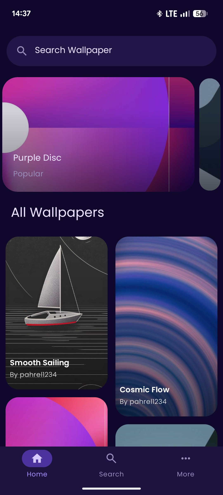
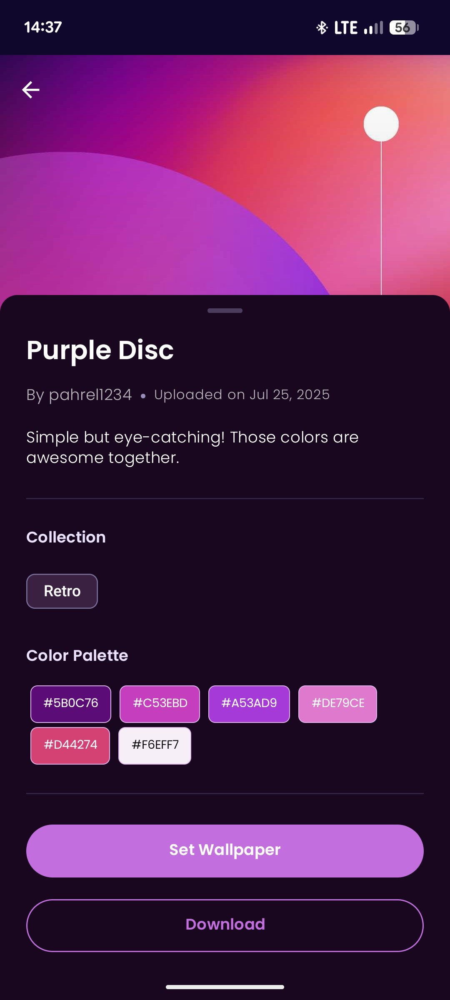
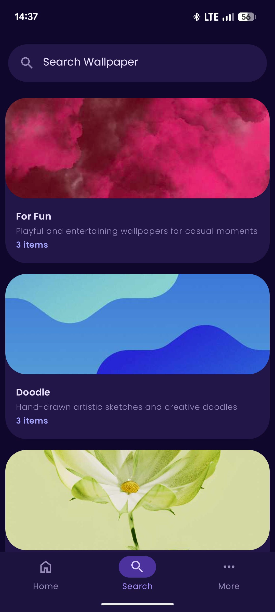

**Rel Wallpaper

A clean and modern wallpaper app built with Java and XML layouts. Browse and search through beautiful wallpaper collections, set them as your device background, and download them for free.
Features

    Extensive wallpaper collections with new additions frequently

    Search functionality to find specific wallpapers

    Seamlessly set wallpapers directly from the app

    Freely download high-quality wallpapers

    Clean UI built with XML layouts

Screenshot

Tech Stack

    Language: Java

    UI: XML Layouts

    API: Pexels API or similar

    Architecture: Native Android

Getting Started

    Clone the repository

    https://github.com/alfahrelrifananda/Rel-Wallpaper.git

    Get your API from supabase

    Add your API key to apikeys.properties:

    SUPABASE_API_KEY=your_supabase_api_key_here
    SUPABASE_URL=your_supabase_url_here

    Build and run the app!

Requirements

    Android Studio

    Minimum SDK: API 24 (Android 7.0)

    Target SDK: API 34

Contributing

Feel free to open issues or submit pull requests. All contributions are welcome!**
